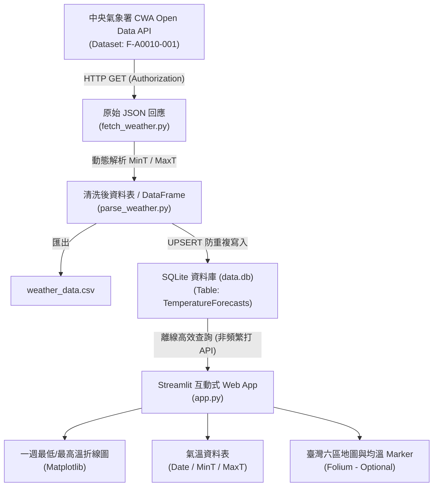

# Taiwan Weather Forecast (HW10 氣象預報系統)

[](https://vercel.com/new/clone?repository-url=https%3A%2F%2Fgithub.com%2FShuShu1201%2FCWA_Web_HW)
[](https://shushu1201.github.io/CWA_Web_HW/)

本專案為「HW10 Taiwan Weather Forecast」課程作業之完整實作。系統串接交通部中央氣象署 (CWA) Open Data API，動態擷取臺灣六大區域之一週氣溫預報資料，經由 Python 結構化解析清洗後存入 SQLite 資料庫，並透過 Streamlit 與 Matplotlib 打造互動式天氣儀表板，支援 Folium 地圖視覺化（可選功能），同時提供一鍵部署至 Vercel 與 GitHub Pages 之現代化可愛風格天氣地圖 Web App。

---

## 📌 系統資料流程架構



---

## 📂 專案檔案結構

```
HW10_Weather/
│
├── fetch_weather.py         # Step 1: 負責呼叫 CWA API 取得原始 JSON 與狀態檢核
├── parse_weather.py         # Step 2: 負責解析 JSON 提取六大區域之每日 MinT 與 MaxT
├── database.py              # Step 3: 負責 SQLite 資料庫管理、UPSERT 寫入與查詢介面
├── app.py                   # Step 4 & 5: Streamlit Web Dashboard 與可選地圖視覺化
├── data.db                  # Step 3: 儲存一週氣溫預報之 SQLite 資料庫檔案
├── weather_data.csv         # Step 2: 解析完成之 CSV 備份檔案
├── sample_cwa_forecast.json # CWA F-A0010-001 真實測試 Fixture (供單元測試離線驗證)
├── test_pipeline.py         # 完整管線自動化測試腳本 (單元與整合測試)
├── requirements.txt         # 專案相依 Python 套件清單
├── .env.example             # 環境變數設定範例檔 (提示 API Key 填寫方式)
├── .gitignore               # Git 忽略檔案設定 (防止 API Key 與資料庫誤上傳)
└── README.md                # 專案完整說明與操作文件
```

---

## 🇹🇼 支援之臺灣六大區域

依作業規範，系統嚴格支援下列六大區域（符合 CWA `F-A0010-001` 官方分區定義）：
1. **北部地區**
2. **中部地區**
3. **南部地區**
4. **東北部地區**
5. **東部地區**
6. **東南部地區**

---

## 🛠️ 環境需求與安裝指南

### 1. 安裝 Python 3 (建議 Python 3.9 ~ 3.12)

請確保系統已安裝 Python 3 與 pip 工具。

### 2. 安裝必要套件

在專案目錄下執行：

```bash
pip install -r requirements.txt
```

> **套件說明**：
> - `requests`: 發送 CWA Open Data API HTTP 請求
> - `pandas`: 處理資料結構與表格轉換
> - `python-dotenv`: 讀取 `.env` 檔案中的環境變數
> - `streamlit`: 建立 Web 儀表板
> - `matplotlib`: 繪製氣溫折線圖
> - `folium` & `streamlit-folium`: (Step 5 可選) 臺灣地圖視覺化

---

## 🔑 CWA_API_KEY 設定步驟

本系統嚴格遵守資安規範，**絕不硬編碼 API Key 於原始碼中**，並自動自環境變數讀取。

1. **申請授權碼**：
   前往 [中央氣象署氣象資料開放平臺](https://opendata.cwa.gov.tw/) 註冊並複製個人專屬授權碼。
2. **建立 `.env` 檔案**：
   複製專案提供的範本檔：
   ```bash
   cp .env.example .env
   ```
3. **填入授權碼**：
   編輯 `.env` 內容：
   ```env
   CWA_API_KEY=CWA-XXXXXXXXXXXXXXXXXXXXXXXXXXXX
   ```
   *(或在終端機執行 `export CWA_API_KEY='您的授權碼'`)*

---

## 🚀 完整執行流程 (Step 1 ~ Step 5)

### 【Step 1：取得 CWA API 資料】
呼叫 CWA API (`F-A0010-001`)，驗證 HTTP 狀態碼與回傳內容，儲存原始 JSON 供偵錯：
```bash
python fetch_weather.py
```
**輸出範例**：
```
✓ API request success   : TRUE
✓ Record 結構狀態        : 存在 (records 包含 2 個頂層鍵)
✓ Region/Location 數量   : 6 個地區
✓ Forecast data 是否存在 : 是
✓ 天氣要素 (Sample)      : MinT, MaxT
```

---

### 【Step 2：解析 JSON 並提取氣溫】
動態解析 API JSON 結構，提取每日最低溫 (MinT) 與最高溫 (MaxT)，並產出 `weather_data.csv`：
```bash
python parse_weather.py raw_weather.json
```
**輸出欄位標準**：
```
regionName | dataDate   | minT | maxT
---------------------------------------
北部地區    | 2026-10-07 | 22.0 | 28.0
中部地區    | 2026-10-07 | 23.0 | 31.0
南部地區    | 2026-10-07 | 24.0 | 32.0
```

---

### 【Step 3：建立與寫入 SQLite 資料庫】
初始化資料庫並寫入/更新氣溫資料，內建 UPSERT 防重複寫入機制：
```bash
# 執行資料庫檢驗與測試
python database.py --test

# (若需從 CSV 匯入)
python database.py --load-csv weather_data.csv

# (若需從 JSON 匯入)
python database.py --load-json raw_weather.json
```

**驗證 SQL 測試**：
1. **列出所有地區**：
   ```sql
   SELECT DISTINCT regionName FROM TemperatureForecasts;
   ```
2. **查詢中部地區**：
   ```sql
   SELECT * FROM TemperatureForecasts WHERE regionName = '中部地區';
   ```

---

### 【Step 4 & Step 5：啟動 Streamlit 儀表板】
啟動 Web 應用程式：
```bash
streamlit run app.py
```

- **Step 4 主要功能**：
  - 網頁標題：`Taiwan Weather Forecast`
  - 下拉選單：`Select Region` (支援切換六大區域)
  - 顯示該區域一週最高溫與最低溫折線圖 (X 軸為日期、Y 軸為氣溫 °C)
  - 顯示一週氣溫資料表 (Date / MinT / MaxT，時間嚴格遞增排序)
  - **重要架構**：所有資料均來自 SQLite (`data.db`)，下拉切換時絕不重複呼叫 CWA API。

- **Step 5 可選功能 (台灣地圖視覺化)**：
  - 若已安裝 `folium` 與 `streamlit-folium`，自動呈現臺灣六區地圖。
  - 依平均溫度自動渲染不同標記色彩：
    - `< 20°C`: 藍色 (寒冷/偏涼)
    - `20–25°C`: 綠色 (舒適)
    - `25–30°C`: 橙色 (溫暖偏熱)
    - `> 30°C`: 紅色 (高溫炎熱)
  - 若未安裝，核心儀表板仍完全正常運作，系統以提示訊息優雅降級。

---

## 🧪 自動化測試與驗證

專案內建完整的自動化測試腳本，涵蓋 Step 1 至 Step 4 的所有關鍵規格驗證：
```bash
python test_pipeline.py
```

測試涵蓋項目：
1. `test_step1_missing_api_key_error`: 驗證缺少 API Key 時之錯誤防護。
2. `test_step2_json_parsing_structure`: 驗證動態解析、六大分區、MinT/MaxT 浮點數轉換、日期格式與邏輯合理性。
3. `test_step3_database_operations_and_upsert`: 驗證 SQLite 資料表建立、防重複寫入 (UPSERT) 與 SQL 查詢。

---

## 🛡️ 異常處理與防護機制

1. **未設定 CWA_API_KEY**：顯示學生友善之繁體中文提示與設定指引，不洩漏任何資訊。
2. **API 連線逾時與中斷**：設定 15 秒 timeout，捕獲 `requests.exceptions.Timeout` 與 `ConnectionError`。
3. **HTTP 401 授權碼失效**：明確提示授權碼無效或過期。
4. **JSON 格式異常或空資料**：檢查 `success` 旗標與 `records` 是否非空。
5. **溫度資料缺失或異常**：自動轉換數值，若缺失填入 `None`，若最低溫高於最高溫則自動校正。
6. **SQLite data.db 尚未建立**：Streamlit 介面彈出教學提示，指引使用者先執行資料擷取流程。
